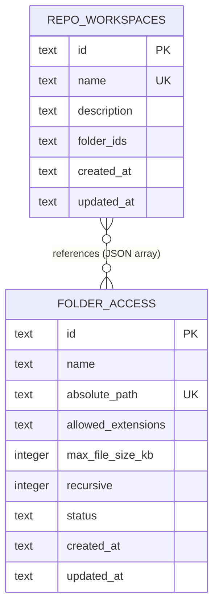

# 3 — Local Repository / Folder Access Requirements

> **Status:** Pending Implementation
> **Created:** 2026-03-24

---

## 1. Context & Business Value

**Goal:** Allow the admin panel user to register one or more **local filesystem paths** (git repos or arbitrary directories) that the MCP server may read. Claude agents connecting over MCP can then list, read, and search files within those registered roots — enabling local code analysis, repo exploration, and file-based context injection without pushing code to a remote service.

Additionally, the admin panel user can group multiple registered repos into a named **Workspace**, enabling agents to perform cross-repo search and analysis in a single tool call — critical for microservice architectures, monorepos split across multiple mounts, and shared-library dependency tracing.

**Target Audience:** Developers running `simple-mcp` locally who want Claude agents to reason over their local codebases, including multi-repo projects.

**Scope:** Read-only filesystem access. No write, rename, delete, or shell-execute operations are in scope.

---

## 2. System Architecture & Integrations

### Dependencies

| Dependency | Purpose |
|---|---|
| `node:fs/promises` | Directory listing, file reads (built-in — no new package) |
| `node:path` | Path canonicalization and traversal guard |
| `fast-glob` | Pattern-based file search across registered roots |
| Existing `connectionsTable` (SQLite) | Stores registered folder access records |
| Existing `credentialsTable` | **Not used** — no secrets for local paths |
| Existing `encryptionService` | **Not used** for this feature |

### Communication

- Admin panel → Management API (Hono HTTP): REST CRUD for folder registrations.
- Claude agent → MCP server: new MCP tools over existing stdio/SSE/HTTP transports.

### New Files Required

```
src/backend/
  services/local-filesystem.service.ts
  tools/local-filesystem/
    fs-read-file.tool.ts
    fs-list-directory.tool.ts
    fs-search-files.tool.ts
    fs-get-file-tree.tool.ts
    fs-workspace-search.tool.ts      ← NEW: cross-repo search
    fs-workspace-tree.tool.ts        ← NEW: merged tree across repos

src/shared/schemas/
  folder-access.schema.ts            ← Zod schema, shared with frontend
  repo-workspace.schema.ts           ← NEW: Zod schema for workspace grouping

src/shared/types.ts                  ← add FolderAccessId, RepoWorkspaceId branded types
```

### Codebase Touch Points (changes to existing files)

| File | Change |
|---|---|
| `src/shared/types.ts` | Add `FolderAccessId`, `RepoWorkspaceId` branded types and creator helpers |
| `src/shared/schemas/connection.schema.ts` | Add `"local-filesystem"` to `integrationType` enum |
| `src/backend/db/schema.ts` | Add `folderAccessTable` and `repoWorkspacesTable` (new tables, see §3) |
| `src/backend/db/repositories/` | Add `folder-access.repository.ts` and `repo-workspaces.repository.ts` |
| `src/backend/server.ts` | Register 6 new tools; inject `LocalFilesystemService` |
| `src/backend/agents/` | Add `local-repo-analysis.agent.ts` |
| `src/backend/agents/index.ts` | Export new agent |
| `src/backend/agents/registry.ts` | Register new agent |
| Admin API HTTP routes (Hono) | Add `/api/folder-access` and `/api/repo-workspaces` CRUD endpoints |

---

## 3. Data Models & State

### New DB Table: `folder_access`

```
id:             TEXT  PRIMARY KEY          — UUID v4, FolderAccessId branded
name:           TEXT  NOT NULL             — human label (e.g. "my-project")
absolute_path:  TEXT  NOT NULL UNIQUE      — canonicalized absolute path on disk
allowed_extensions: TEXT NOT NULL DEFAULT '[]'
                                           — JSON array of extensions e.g. [".ts",".md"]
                                           — empty array = all extensions allowed
max_file_size_kb:   INTEGER NOT NULL DEFAULT 512
                                           — per-file read limit in KB; max 10240 (10 MB)
recursive:      INTEGER NOT NULL DEFAULT 1 — 0 = top-level only, 1 = recursive
status:         TEXT NOT NULL DEFAULT 'active'
                                           — "active" | "path_not_found" | "disabled"
created_at:     TEXT NOT NULL              — ISO 8601
updated_at:     TEXT NOT NULL              — ISO 8601
```

### Zod Schema (`src/shared/schemas/folder-access.schema.ts`)

```typescript
export const FolderAccessStatusSchema = z.enum([
  "active",
  "path_not_found",
  "disabled",
]);

export const FolderAccessConfigSchema = z.object({
  id:                   z.string().min(1),
  name:                 z.string().min(1).max(100),
  absolutePath:         z.string().min(1),
  allowedExtensions:    z.array(z.string().startsWith(".")).default([]),
  maxFileSizeKb:        z.number().int().min(1).max(10240).default(512),
  recursive:            z.boolean().default(true),
  status:               FolderAccessStatusSchema,
  createdAt:            z.string().datetime(),
  updatedAt:            z.string().datetime(),
});

export type FolderAccessConfig = z.infer<typeof FolderAccessConfigSchema>;
```

### New DB Table: `repo_workspaces`

```
id:             TEXT  PRIMARY KEY          — UUID v4, RepoWorkspaceId branded
name:           TEXT  NOT NULL UNIQUE      — human label (e.g. "checkout-microservices")
description:    TEXT  NOT NULL DEFAULT ''  — optional freetext description
folder_ids:     TEXT  NOT NULL DEFAULT '[]'
                                           — JSON array of FolderAccessId strings
                                           — order preserved (affects merge order in tree output)
created_at:     TEXT  NOT NULL             — ISO 8601
updated_at:     TEXT  NOT NULL             — ISO 8601
```

**Constraints:**
- A workspace must reference ≥ 2 distinct `folder_access` IDs (a single-repo "workspace" is just the folder itself).
- A `folder_access` record may belong to multiple workspaces.
- Deleting a `folder_access` record does NOT auto-delete workspaces — it removes the ID from any `folder_ids` arrays. If that removal would leave a workspace with < 2 repos, the workspace is also deleted and the caller receives a `204` with header `X-Workspace-Removed: <id>`.

### Zod Schemas — Workspace (`src/shared/schemas/repo-workspace.schema.ts`)

```typescript
export const RepoWorkspaceSchema = z.object({
  id:          z.string().min(1),
  name:        z.string().min(1).max(100),
  description: z.string().max(500).default(""),
  folderIds:   z.array(z.string().min(1)).min(2).max(20),
  createdAt:   z.string().datetime(),
  updatedAt:   z.string().datetime(),
});

export type RepoWorkspace = z.infer<typeof RepoWorkspaceSchema>;

export const CreateRepoWorkspaceSchema = RepoWorkspaceSchema.pick({
  name: true,
  description: true,
  folderIds: true,
});
```

### Mermaid ER Diagram



---

## 4. API Contracts / Interfaces

### 4.1 Admin REST Endpoints (Hono HTTP layer)

#### `GET /api/folder-access`
List all registered folder access entries.

**Response `200`:**
```json
[
  {
    "id": "uuid",
    "name": "my-api-project",
    "absolutePath": "/Users/dev/projects/my-api",
    "allowedExtensions": [".ts", ".json", ".md"],
    "maxFileSizeKb": 512,
    "recursive": true,
    "status": "active",
    "createdAt": "2026-03-24T10:00:00Z",
    "updatedAt": "2026-03-24T10:00:00Z"
  }
]
```

---

#### `POST /api/folder-access`
Register a new folder.

**Request body:**
```json
{
  "name": "string (required, 1–100 chars)",
  "absolutePath": "string (required, must be absolute)",
  "allowedExtensions": ["string"] ,
  "maxFileSizeKb": "integer 1–10240 (default: 512)",
  "recursive": "boolean (default: true)"
}
```

**Response `201`:** Full `FolderAccessConfig` object.

**Validation rules (server-side):**
- `absolutePath` must start with `/` (absolute path).
- `absolutePath` is canonicalized via `path.resolve()` before storage (resolves symlinks, `..` etc).
- If the resolved path does not exist on disk at registration time, still save it but set `status = "path_not_found"`.
- Duplicate `absolute_path` → `409 Conflict`.

---

#### `PATCH /api/folder-access/:id`
Update name, extensions, size limit, recursive flag, or enable/disable.

**Request body (all fields optional):**
```json
{
  "name": "string",
  "allowedExtensions": ["string"],
  "maxFileSizeKb": "integer",
  "recursive": "boolean",
  "status": "active | disabled"
}
```

**Note:** `absolutePath` is **immutable** after creation. To change path, delete and recreate.

**Response `200`:** Updated `FolderAccessConfig`.

---

#### `DELETE /api/folder-access/:id`
Remove a registration. Does **not** delete files on disk.

**Response `204 No Content`.**

---

#### `POST /api/folder-access/:id/verify`
Re-check whether the registered path exists on disk and update `status` accordingly.

**Response `200`:**
```json
{ "id": "uuid", "status": "active | path_not_found" }
```

---

### 4.2 MCP Tool Contracts

#### `fs_list_directory`
List files and subdirectories at a given path within a registered root.

**Input:**
```json
{
  "folder_access_id": "string (required) — ID from registered folder_access",
  "relative_path":    "string (default: '.') — relative to the registered root",
  "max_depth":        "integer 1–10 (default: 1)"
}
```

**Output:**
```json
{
  "root": "/Users/dev/projects/my-api",
  "relative_path": "src",
  "entries": [
    { "name": "index.ts", "type": "file", "size_bytes": 1240, "modified_at": "ISO8601" },
    { "name": "services", "type": "directory" }
  ]
}
```

---

#### `fs_read_file`
Read the contents of a single file within a registered root.

**Input:**
```json
{
  "folder_access_id": "string (required)",
  "relative_path":    "string (required) — e.g. 'src/services/auth.service.ts'",
  "encoding":         "utf-8 | base64 (default: utf-8)"
}
```

**Output:**
```json
{
  "absolute_path": "/Users/dev/projects/my-api/src/services/auth.service.ts",
  "size_bytes": 3412,
  "content": "...file contents...",
  "encoding": "utf-8"
}
```

---

#### `fs_search_files`
Search for files by glob pattern or content substring within a registered root.

**Input:**
```json
{
  "folder_access_id":  "string (required)",
  "glob_pattern":      "string (optional) — e.g. '**/*.ts'",
  "content_query":     "string (optional) — substring/literal to search inside files",
  "max_results":       "integer 1–200 (default: 50)",
  "include_content_snippet": "boolean (default: false) — include matching line + context"
}
```

**Output:**
```json
{
  "total_matched": 12,
  "results": [
    {
      "relative_path": "src/services/auth.service.ts",
      "size_bytes": 3412,
      "snippet": "...line containing match..."
    }
  ]
}
```

---

#### `fs_get_file_tree`
Return a full recursive tree structure of the registered root (respecting `max_file_size_kb` and `allowed_extensions` config).

**Input:**
```json
{
  "folder_access_id": "string (required)",
  "max_depth":        "integer 1–20 (default: 5)",
  "include_hidden":   "boolean (default: false)"
}
```

**Output:**
```json
{
  "root": "/Users/dev/projects/my-api",
  "tree": {
    "name": "my-api",
    "type": "directory",
    "children": [
      { "name": "src", "type": "directory", "children": [ ... ] },
      { "name": "package.json", "type": "file", "size_bytes": 890 }
    ]
  }
}
```

---

---

### 4.2b Admin REST Endpoints — Workspaces

#### `GET /api/repo-workspaces`
List all workspaces.

**Response `200`:**
```json
[
  {
    "id": "uuid",
    "name": "checkout-microservices",
    "description": "All repos in the checkout domain",
    "folderIds": ["uuid-a", "uuid-b", "uuid-c"],
    "createdAt": "2026-03-24T10:00:00Z",
    "updatedAt": "2026-03-24T10:00:00Z"
  }
]
```

---

#### `POST /api/repo-workspaces`
Create a new workspace.

**Request body:**
```json
{
  "name":        "string (required, 1–100 chars, unique)",
  "description": "string (optional, max 500 chars)",
  "folderIds":   ["uuid", "uuid"]
}
```

**Validation rules:**
- `folderIds` must contain ≥ 2 entries.
- All `folderIds` must reference existing `folder_access` records. Unknown IDs → `422 Unprocessable Entity` with list of invalid IDs.
- Duplicate `name` → `409 Conflict`.

**Response `201`:** Full `RepoWorkspace` object.

---

#### `PATCH /api/repo-workspaces/:id`
Update workspace name, description, or folder membership.

**Request body (all fields optional):**
```json
{
  "name":        "string",
  "description": "string",
  "folderIds":   ["uuid"]
}
```

**Note:** `folderIds` replaces the full list (not a partial merge). Provide the complete desired set.

**Response `200`:** Updated `RepoWorkspace`.

---

#### `DELETE /api/repo-workspaces/:id`
Remove a workspace definition. Does not affect the underlying `folder_access` records.

**Response `204 No Content`.**

---

### 4.2c MCP Tool Contracts — Cross-Repo (Workspace)

#### `fs_workspace_search`
Search for files or content across all repos in a workspace in a single call.

**Input:**
```json
{
  "workspace_id":            "string (required)",
  "glob_pattern":            "string (optional)",
  "content_query":           "string (optional)",
  "max_results_per_repo":    "integer 1–100 (default: 25)",
  "include_content_snippet": "boolean (default: false)"
}
```

**Output:**
```json
{
  "workspace_id":   "uuid",
  "workspace_name": "checkout-microservices",
  "repos_searched": 3,
  "total_matched":  18,
  "results": [
    {
      "folder_access_id":   "uuid-a",
      "repo_name":          "checkout-api",
      "repo_root":          "/Users/dev/checkout-api",
      "relative_path":      "src/handlers/payment.ts",
      "size_bytes":         2310,
      "snippet":            "...matching line..."
    }
  ]
}
```

**Behaviour:** Fan-out to each active `folder_access` in the workspace in parallel (via `Promise.all`). Repos with `status !== "active"` are skipped with a warning entry in a top-level `skipped_repos` array. Results from all repos are merged and returned; total matches across all repos capped at `max_results_per_repo * repo_count`.

---

#### `fs_workspace_tree`
Return a merged file tree with each repo as a named top-level node.

**Input:**
```json
{
  "workspace_id":  "string (required)",
  "max_depth":     "integer 1–10 (default: 3)",
  "include_hidden": "boolean (default: false)"
}
```

**Output:**
```json
{
  "workspace_id":   "uuid",
  "workspace_name": "checkout-microservices",
  "repos": [
    {
      "folder_access_id": "uuid-a",
      "repo_name":        "checkout-api",
      "root":             "/Users/dev/checkout-api",
      "status":           "active",
      "tree": { "name": "checkout-api", "type": "directory", "children": [...] }
    },
    {
      "folder_access_id": "uuid-b",
      "repo_name":        "payment-service",
      "root":             "/Users/dev/payment-service",
      "status":           "path_not_found",
      "tree":             null
    }
  ]
}
```

**Note:** Each repo's tree is fetched independently and sandboxed. An unavailable repo sets `tree: null` and `status: "path_not_found"` — it does not fail the whole call.

---

### 4.3 LocalFilesystemService Interface (`src/backend/services/local-filesystem.service.ts`)

```typescript
export interface LocalFilesystemService {
  // Single-repo operations
  listDirectory(folderId: FolderAccessId, relativePath: string, maxDepth: number): Promise<Result<DirectoryListing, DomainError>>;
  readFile(folderId: FolderAccessId, relativePath: string, encoding: "utf-8" | "base64"): Promise<Result<FileContent, DomainError>>;
  searchFiles(folderId: FolderAccessId, options: FileSearchOptions): Promise<Result<FileSearchResult, DomainError>>;
  getFileTree(folderId: FolderAccessId, maxDepth: number, includeHidden: boolean): Promise<Result<FileTree, DomainError>>;
  verifyPath(folderId: FolderAccessId): Promise<Result<FolderAccessStatus, DomainError>>;

  // Cross-repo workspace operations
  workspaceSearch(workspaceId: RepoWorkspaceId, options: WorkspaceSearchOptions): Promise<Result<WorkspaceSearchResult, DomainError>>;
  workspaceTree(workspaceId: RepoWorkspaceId, maxDepth: number, includeHidden: boolean): Promise<Result<WorkspaceTreeResult, DomainError>>;
}
```

**Workspace operation types:**
```typescript
export type WorkspaceSearchOptions = {
  readonly globPattern?:           string;
  readonly contentQuery?:          string;
  readonly maxResultsPerRepo:      number;   // 1–100
  readonly includeContentSnippet:  boolean;
};

export type WorkspaceSearchResult = {
  readonly workspaceId:   RepoWorkspaceId;
  readonly workspaceName: string;
  readonly reposSearched: number;
  readonly totalMatched:  number;
  readonly skippedRepos:  ReadonlyArray<{ folderId: FolderAccessId; reason: string }>;
  readonly results:       ReadonlyArray<WorkspaceFileMatch>;
};

export type WorkspaceTreeResult = {
  readonly workspaceId:   RepoWorkspaceId;
  readonly workspaceName: string;
  readonly repos:         ReadonlyArray<RepoTreeEntry>;
};
```

---

## 5. Strict Business Rules & Logic

### Single-Repo Rules

1. **Path sandboxing (critical security rule):** Every resolved file path MUST start with the registered `absolute_path`. Any path that resolves outside the root (e.g. via `../../etc/passwd` traversal) is rejected immediately with `PERMISSION_DENIED` — do not read the file, do not log the attempted target path.
2. **`absolute_path` canonicalization:** Always call `path.resolve(registeredRoot, relativePath)` and verify `resolvedPath.startsWith(canonicalRoot)` before any `fs` call.
3. **Extension allowlist:** If `allowed_extensions` is non-empty, reject reads for files whose extension is not in the list with `INVALID_ARGUMENT`.
4. **File size cap:** If a file's `stat.size` exceeds `max_file_size_kb * 1024`, reject the read with `PAYLOAD_TOO_LARGE`. Never stream partial reads.
5. **`status` check:** Tools MUST check that `status === "active"` before processing. If `status === "path_not_found"` or `"disabled"`, return `UNAVAILABLE` without touching the filesystem.
6. **Hidden files:** Files/directories starting with `.` are excluded by default. Only included when `include_hidden: true` is explicitly passed to `fs_get_file_tree`.
7. **`max_results` hard cap:** `fs_search_files` returns at most 200 results regardless of `max_results` input.
8. **Binary file detection:** If `encoding === "utf-8"` and the file contains null bytes, return a `BINARY_FILE` error — do not return corrupted content.
9. **No symlink traversal outside root:** Symlinks are resolved, and the resolved target must also be within the registered root. External symlinks → `PERMISSION_DENIED`.

### Multi-Repo Workspace Rules

10. **Workspace requires ≥ 2 repos:** Creating or patching a workspace to fewer than 2 `folderIds` → `INVALID_ARGUMENT`.
11. **Max workspace size:** A workspace may contain at most **20** `folder_access` entries. Beyond this → `INVALID_ARGUMENT`.
12. **Fan-out isolation:** Each repo in a workspace search/tree is processed independently and sandboxed. A single repo failure (I/O error, path not found) is captured in `skipped_repos` and MUST NOT abort the rest — partial results are returned with `200`.
13. **Sandboxing still applies per-repo:** Each repo in a workspace still enforces its own `allowed_extensions`, `max_file_size_kb`, and path sandboxing rules independently.
14. **Cross-repo total cap:** `fs_workspace_search` total results across all repos are capped at `max_results_per_repo × repo_count`. No individual repo returns more than `max_results_per_repo` results.
15. **Workspace `folder_ids` referential integrity:** If a `folder_access` record is deleted, all workspace `folder_ids` arrays are updated to remove that ID. Workspaces that drop below 2 entries are automatically deleted.
16. **Concurrent fan-out:** `Promise.all()` is used for workspace operations. Total wall-clock time is bounded by the slowest single repo, not the sum of all repos.
17. **Workspace name uniqueness:** Workspace `name` must be unique across all workspaces (case-sensitive).

---

## 6. Edge Cases & Error Handling

| Scenario | Error `_tag` | HTTP/MCP Response |
|---|---|---|
| Path traversal attempt (`../../etc`) | `PERMISSION_DENIED` | 403 — do NOT log the attempted path |
| `folder_access_id` not found in DB | `NOT_FOUND` | 404 |
| `status !== "active"` | `UNAVAILABLE` | 503 + `{ reason: "path_not_found \| disabled" }` |
| File extension not in allowlist | `INVALID_ARGUMENT` | 400 + `{ allowed: [".ts", ...] }` |
| File exceeds `max_file_size_kb` | `PAYLOAD_TOO_LARGE` | 413 + `{ size_bytes, limit_bytes }` |
| Binary file read as utf-8 | `BINARY_FILE` | 422 — suggest `encoding: "base64"` |
| Symlink resolves outside root | `PERMISSION_DENIED` | 403 |
| `glob_pattern` is malformed | `INVALID_ARGUMENT` | 400 + parse error message |
| Disk I/O error (permissions, unmounted) | `INTERNAL` | 500 — log full error server-side, return generic message to agent |
| Duplicate `absolutePath` on register | `CONFLICT` | 409 |
| `workspace_id` not found | `NOT_FOUND` | 404 |
| Workspace created with < 2 `folderIds` | `INVALID_ARGUMENT` | 400 + `{ min: 2 }` |
| Workspace created with > 20 `folderIds` | `INVALID_ARGUMENT` | 400 + `{ max: 20 }` |
| `folderIds` contains unknown IDs | `UNPROCESSABLE_ENTITY` | 422 + `{ invalid_ids: [...] }` |
| All repos in workspace unavailable | `UNAVAILABLE` | 503 + full `skipped_repos` list |
| Partial repos unavailable in workspace | — (not an error) | 200 + `skipped_repos` populated |
| Duplicate workspace `name` | `CONFLICT` | 409 |

All errors follow the `Result<T, DomainError>` pattern. Never throw from service layer.

---

## 7. Acceptance Criteria (BDD)

**Directory listing**
- **Given** a registered, active folder at `/projects/my-api`
- **When** `fs_list_directory` is called with `relative_path: "src"`, `max_depth: 1`
- **Then** returns a flat list of files and subdirectories directly under `src/`

**File read**
- **Given** a `.ts` file within the registered root, under the size limit
- **When** `fs_read_file` is called with `encoding: "utf-8"`
- **Then** returns the file content as a UTF-8 string with correct `size_bytes`

**Path traversal blocked**
- **Given** a registered root at `/projects/my-api`
- **When** `fs_read_file` is called with `relative_path: "../../etc/passwd"`
- **Then** returns `PERMISSION_DENIED` and the file is NOT read

**Extension allowlist enforced**
- **Given** folder registered with `allowedExtensions: [".ts"]`
- **When** `fs_read_file` is called for `package.json`
- **Then** returns `INVALID_ARGUMENT` error

**Inactive path**
- **Given** a folder registration whose path no longer exists on disk
- **When** any MCP tool is called for that `folder_access_id`
- **Then** returns `UNAVAILABLE` with `reason: "path_not_found"` — no filesystem call made

**Search with glob**
- **Given** a registered root containing 8 `.ts` files, 3 `.json` files
- **When** `fs_search_files` is called with `glob_pattern: "**/*.ts"`, `max_results: 5`
- **Then** returns exactly 5 results, all with `.ts` extension

**Agent: local-repo-analysis**
- **Given** the `local-repo-analysis` agent is enabled and a root is registered
- **When** an agent session starts
- **Then** the agent has access to `fs_list_directory`, `fs_read_file`, `fs_search_files`, `fs_get_file_tree`, `fs_workspace_search`, `fs_workspace_tree`

---

**Cross-repo workspace search**
- **Given** a workspace with 3 active repos, each containing 10 `.ts` files with the string `"PaymentService"`
- **When** `fs_workspace_search` is called with `content_query: "PaymentService"`, `max_results_per_repo: 5`
- **Then** returns up to 15 results total (5 per repo), `repos_searched: 3`, `skipped_repos: []`

**Partial repo unavailability**
- **Given** a workspace with 3 repos, where repo B has `status: "path_not_found"`
- **When** `fs_workspace_search` is called
- **Then** returns results from repos A and C only; `skipped_repos` contains one entry for repo B; HTTP status is `200` (not 503)

**All repos unavailable**
- **Given** a workspace where all 3 repos have `status !== "active"`
- **When** `fs_workspace_search` is called
- **Then** returns `UNAVAILABLE` (503) with the full `skipped_repos` list

**Workspace tree merged view**
- **Given** a workspace with 2 active repos: `api` (5 top-level dirs) and `shared` (3 top-level dirs)
- **When** `fs_workspace_tree` is called with `max_depth: 2`
- **Then** returns a `repos` array of 2 entries, each with a populated `tree` up to depth 2

**Folder deletion cascades to workspace**
- **Given** workspace W references folder IDs `[A, B, C]`
- **When** folder B is deleted via `DELETE /api/folder-access/B`
- **Then** workspace W's `folderIds` becomes `[A, C]` and workspace W still exists (2 entries remain)

**Folder deletion drops workspace below minimum**
- **Given** workspace W references folder IDs `[A, B]`
- **When** folder A is deleted
- **Then** workspace W is automatically deleted; response header `X-Workspace-Removed: <W id>` is set on the `DELETE /api/folder-access/A` response

**Workspace minimum size enforced on create**
- **Given** a request to create a workspace with `folderIds: ["uuid-a"]`
- **When** `POST /api/repo-workspaces` is called
- **Then** returns `400 INVALID_ARGUMENT` with `{ min: 2 }`
